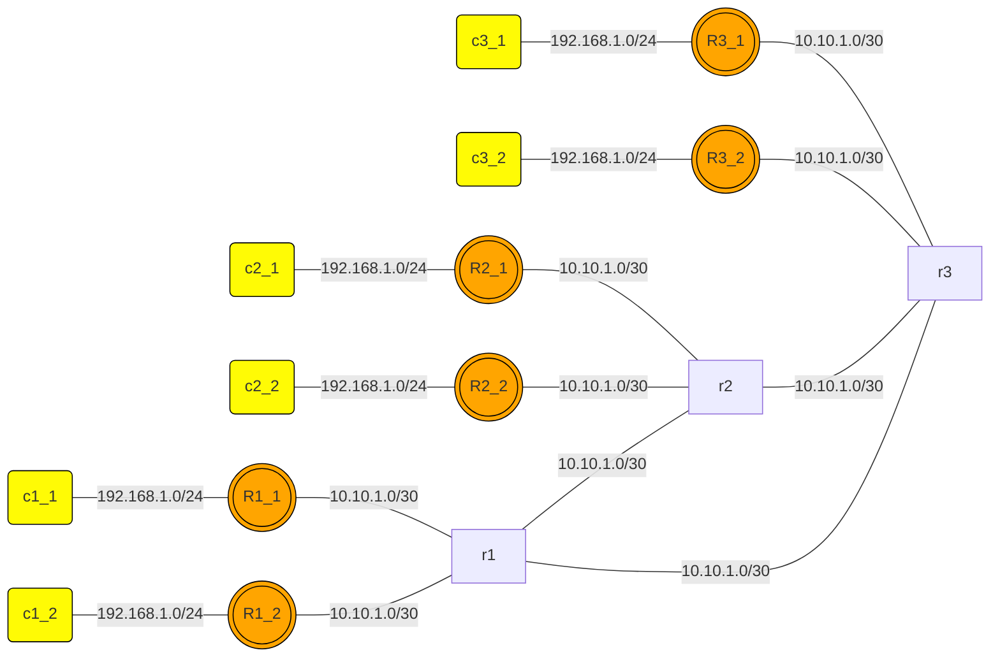

## ospf lab

```mermaid
graph LR;
%%Colors

classDef host fill:#fffb05, stroke:#000000;
classDef switch fill:#1fd655, stroke:#000000;
classDef router fill:#ffa500, stroke:#000000;

%%element
c1_1(c1_1):::host
c1_2(c1_2):::host
c2_1(c2_1):::host
c2_2(c2_2):::host
c3_1(c3_1):::host
c3_2(c3_2):::host
r1_1(((R1_1))):::router
r1_2(((R1_2))):::router
r2_1(((R2_1))):::router
r2_2(((R2_2))):::router
r3_1(((R3_1))):::router
r3_2(((R3_2))):::router


%%connectivity

c1_1 -- 192.168.1.0/24 --- r1_1
c1_2 -- 192.168.1.0/24 --- r1_2

c2_1 -- 192.168.1.0/24 --- r2_1
c2_2 -- 192.168.1.0/24 --- r2_2

c3_1 -- 192.168.1.0/24 --- r3_1
c3_2 -- 192.168.1.0/24 --- r3_2

r1_1 -- 10.10.1.0/30 --- r1
r1_2 -- 10.10.1.0/30 --- r1

r2_1 -- 10.10.1.0/30 --- r2
r2_2 -- 10.10.1.0/30 --- r2

r3_1 -- 10.10.1.0/30 --- r3
r3_2 -- 10.10.1.0/30 --- r3

r1 -- 10.10.1.0/30 --- r2
r1 -- 10.10.1.0/30 --- r3
r2 -- 10.10.1.0/30 --- r3
```

