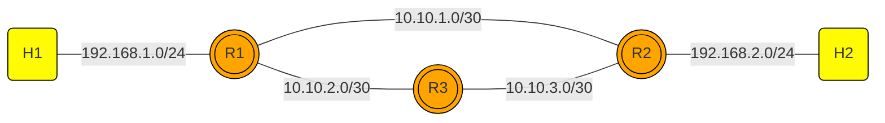

# Project-JARKOMLAN

This is a project that will explain simple configuration about network , starting from Static Routing , OSPF , iBGP and eBGP. (All of these work were created and run in linux virtual machine , WSL and ubuntu related enivronment should be fine)

# Table of Content

- Static Routing
- OSPF
- iBGP & eBGP

## Getting Started

These instructions will get you a copy of the project up and running on your local machine for development and testing purposes. See deployment for notes on how to deploy the project on a live system.

### Prerequisites

What things you need to install the software and how to install them

Download Mininet
```
git clone https://github.com/mininet/mininet
cd mininet
git tag  # list available versions
git checkout -b mininet-2.3.0 2.3.0  # or whatever version you wish to install
cd ..
mininet/util/install.sh -a # to install everything 

sudo mn --switch ovsbr --test pingall # to test the instalation of mininet
```

full documentation is in this link https://mininet.org/download/

Download frrouting
```
sudo apt install frrouting
```
This command should be worked and will be downloading 8.1 version and it will work just fine , you can update it to 8.5.6 (newer version) if necessary

### Installing

A step by step series of examples that tell you how to get a development env running

1. clone this repository

```
https://github.com/Ibets/Project-JARKOMLAN/
```

2. Run the script !!
```
sudo python3 static_routing_2rtr.py
sudo python3 ospf-lab.py
sudo pyhton3 ibgp-ibgp.py
```
if you succeeded in running one of these then you should get this response :


Then you can run this project .

End with an example of getting some data out of the system or using it for a little demo

## Running the tests

Explain how to run the automated tests for this system

### Break down into end to end tests

Explain what these tests test and why

```
Give an example
```

### And coding style tests

Explain what these tests test and why

```
Give an example
```

## Deployment

Add additional notes about how to deploy this on a live system

## Built With

* Python
* Mininet

## Contributing

Please read [CONTRIBUTING.md](https://gist.github.com/PurpleBooth/b24679402957c63ec426) for details on our code of conduct, and the process for submitting pull requests to us.

## Versioning

We use [SemVer](http://semver.org/) for versioning. For the versions available, see the [tags on this repository](https://github.com/your/project/tags). 

## Authors

* **Billie Thompson** - *Initial work* - [PurpleBooth](https://github.com/PurpleBooth)

See also the list of [contributors](https://github.com/your/project/contributors) who participated in this project.

## License

This project is licensed under the MIT License - see the [LICENSE.md](LICENSE.md) file for details

## Acknowledgments

* Hat tip to anyone whose code was used
* Inspiration
* etc


# NET101
NET101 is a repository to learn about network from traditional to programmable network using mininet environment.

## Requirement
You need to install mininet on your Ubuntu Linux Server. To install mininet you can just go to the repository and clone it to your linux locally.

```
    git clone https://github.com/mininet/mininet.git
    cd mininet
    ./util/install.sh -a 
```
## Static and Dynamic Routing



# Projectfile
