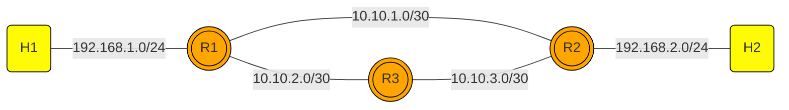

## Static and Dynamic Routing



# Static Routing in Mininet

This repository demonstrates the implementation of static routing in a Mininet environment with the following topology:

## Environment

- **Operating System:** VirtualBox Ubuntu 22.04
- **Tools:** Mininet, `net101` repository
- **Routing Software:** FRR (Free Range Routing) version 8.5.4

---

## Steps to Set Up

### 1. Cloning and Modifying Files
- Clone the this repository.
### 2. Run the script
```
sudo python3 static_routing_2rtr.py
```

---

## Configuration

### Router R3 Configuration (`frr.conf`)
```plaintext
frr version 8.5.4
frr defaults traditional
hostname r3
service integrated-vtysh-config
!
interface r3-eth0
 ip address 10.10.2.2/30
exit
!
interface r3-eth1
 ip address 10.10.3.2/30
exit
!
ip route 192.168.1.0/24 10.10.2.1
ip route 192.168.2.0/24 10.10.3.1
!
```

### Router R1 Configuration (`frr.conf`)
```plaintext
frr version 8.5.4
frr defaults traditional
hostname r1
service integrated-vtysh-config
!
interface r1-eth0
 ip address 192.168.1.1/24
exit
!
interface r1-eth1
 ip address 10.10.1.1/30
exit
!
interface r1-eth2
 ip address 10.10.2.1/30
exit
!
ip route 192.168.2.0/24 10.10.1.2
ip route 192.168.2.0/24 10.10.2.2 10
ip route 10.10.3.0/30 10.10.2.2 10
!
```

### Router R2 Configuration (`frr.conf`)
```plaintext
frr version 8.5.4
frr defaults traditional
hostname r2
service integrated-vtysh-config
!
interface r2-eth0
 ip address 192.168.2.1/24
exit
!
interface r2-eth1
 ip address 10.10.1.2/30
exit
!
interface r2-eth2
 ip address 10.10.3.1/30
exit
!
ip route 192.168.1.0/24 10.10.1.1
ip route 192.168.1.0/24 10.10.3.2 10
ip route 10.10.2.0/30 10.10.3.2 10
!
```

---

## Running the Topology

1. Run the Python script:
   ```bash
   sudo python3 static_routing_2rtr.py
   ```

2. Connect to the routers and configure manually if needed:
   ```bash
   ./connect.sh <router-name> vtysh
   ```

3. Verify configuration with:
   ```bash
   show running-config
   ```

---

## Testing and Verification

### Ping Tests
Use the following ping commands to verify connectivity:
- **Ping from R1 to R3**
- **Ping from R2 to R3**
- **Ping from R3 to R1**

### Traceroute Test
Run traceroute from `h1` to `h2` in the following scenarios:
1. **Before disconnecting R1-R2**
2. **After disconnecting R1-R2**
3. **After reconnecting R1-R2**

Example:
```bash
h1 traceroute h2
```

### Observations
- **Before Disconnecting R1-R2:** Traffic flows directly through `R1-R2` via network `10.10.1.0/30`.
- **After Disconnecting R1-R2:** Static routing redirects traffic through the backup path via `R3` using networks `10.10.2.0/30` and `10.10.3.0/30`.
- **After Reconnecting R1-R2:** Traffic returns to the primary path `R1-R2` due to lower administrative distance.

---

## Conclusion
Static routing is a reliable method for small networks and provides predictable routing paths. By configuring administrative distances, we can establish failover paths for increased network resilience. This lab demonstrates how static routing handles failover scenarios effectively in a Mininet environment.
